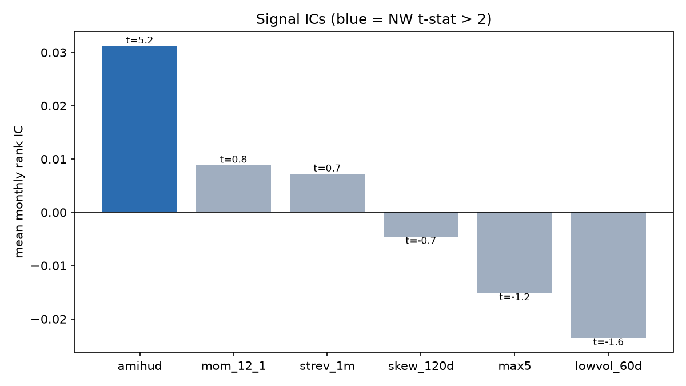
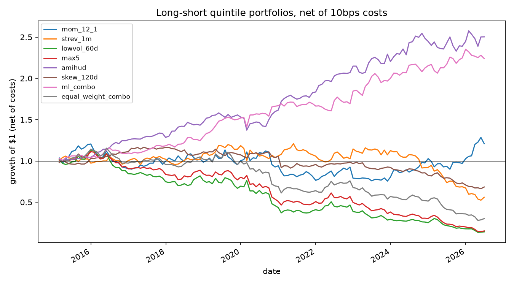

# equity-xs-alpha

Cross-sectional equity alpha research, end to end: signal construction → information
coefficient analysis → cost-aware long-short portfolios → ML signal combination under
purged walk-forward cross-validation.

The point of this repo is not "here is a Sharpe 3 strategy" (it isn't, and single-name
monthly factors on the S&P 500 shouldn't be). The point is the **research process**:
every number is out-of-sample where it claims to be, significance is measured with
autocorrelation-robust errors, and costs are charged before anything is called
performance.

```
pip install -e ".[dev]"
python scripts/run_research.py      # full run: download -> signals -> IC -> portfolios -> ML
pytest                              # 16 tests on synthetic data
```

Results land in `reports/results.md` and `reports/figures/`.

## Pipeline

```
universe.py    S&P 500 members (Wikipedia scrape), >=3y history filter
data.py        yfinance daily adjusted close + dollar volume, parquet cache
signals.py     6 signals, winsorized (median +/- 3*1.4826*MAD) and z-scored per date
ic.py          Spearman rank IC, Newey-West t-stats, IC decay by horizon
portfolio.py   quintile long-short, equal weight per leg, linear cost model
cv.py          purged walk-forward folds with embargo
ml.py          LightGBM on cross-sectional rank labels, OOS scores only
```

## Signals

All signals are oriented so that **higher = higher expected forward return**, sampled
at month-end, and cleaned cross-sectionally. With daily returns $r_{i,t}$ and prices
$P_{i,t}$:

**Momentum (12-1)** — Jegadeesh & Titman (1993). Formation over months $t-12 \dots t-1$,
skipping the most recent month to avoid contamination by short-term reversal:

$$\text{MOM}_{i,t} = \prod_{s=t-252}^{t-21}(1+r_{i,s}) - 1$$

**Short-term reversal** — Jegadeesh (1990). Last month's losers outperform:

$$\text{STREV}_{i,t} = -\left(P_{i,t}/P_{i,t-21} - 1\right)$$

**Low volatility** — Ang, Hodrick, Xing & Zhang (2006). Negative of 60-day realized
daily-return standard deviation.

**MAX effect** — Bali, Cakici & Whitelaw (2011). Lottery-like names underperform; the
signal is the negative of the mean of the 5 largest daily returns over the last 21 days.

**Amihud illiquidity** — Amihud (2002). Illiquidity premium, log-compressed because the
raw measure spans orders of magnitude even inside the S&P 500:

$$\text{ILLIQ}_{i,t} = \log\left(\frac{1}{63}\sum_{s=t-62}^{t}\frac{|r_{i,s}|}{\text{DollarVol}_{i,s}}\right)$$

**Skewness** — negative of 120-day return skewness (investors overpay for positive skew).

Cleaning per cross-section: winsorize at median $\pm 3 \times 1.4826 \times \text{MAD}$
(the 1.4826 factor makes MAD consistent with $\sigma$ under normality), then z-score.

## Methodology

### Information coefficient

$$\text{IC}_t = \text{corr}_{\text{Spearman}}\left(\text{signal}_{i,t},\; r_{i,t \to t+1}\right)$$

Monthly ICs are autocorrelated (signals overlap heavily month to month), so the
reported t-stat on the mean IC uses a **Newey-West (1987)** variance with a Bartlett
kernel at 6 lags:

$$\hat{V} = \hat\gamma_0 + 2\sum_{\ell=1}^{L}\left(1-\tfrac{\ell}{L+1}\right)\hat\gamma_\ell,
\qquad t = \frac{\overline{\text{IC}}}{\sqrt{\hat V / n}}$$

**IC decay** re-computes the mean IC against $k$-month-forward returns,
$k \in \{1,2,3,6,12\}$. Flat decay means the signal survives slow rebalancing; steep
decay means turnover (and therefore costs) is structural.

### Portfolios and costs

Top-minus-bottom quintile, equal weight inside each leg, dollar neutral, monthly
rebalance. Costs are linear: one-way turnover $\times$ 10 bps, charged every rebalance:

$$r^{\text{net}}_t = w_t^\top r_{t\to t+1} - \frac{\lVert w_t - w_{t-1}\rVert_1}{2}\cdot\text{10bps}$$

10 bps one-way is conservative-realistic for S&P 500 names at institutional size; the
cost parameter is a single argument if you want to stress it.

### Purged walk-forward CV

Random K-fold leaks here: the label at $t$ is the return over $(t, t+1]$, so adjacent
train/test samples share information (López de Prado, *Advances in Financial ML*, ch. 7).
The splitter in `cv.py` trains on an expanding window, **embargoes** one period between
train end and test start (removing the one-period label overlap), and predicts strictly
forward — 60 months minimum training, 12-month test blocks, rolled to the end of sample.

The ML model is deliberately boring: shallow LightGBM (depth 4, 15 leaves, heavy
subsampling) regressing the **cross-sectional percentile rank** of next-month return on
the 6 signals. Rank labels keep the target stationary across vol regimes. The model's
OOS score is then treated exactly like any raw signal — same z-scoring, same quintile
portfolio, same costs — so the comparison against the equal-weight signal combo is fair.

## Results

<!-- RESULTS:BEGIN -->
From the committed run — 496 names, 2010-01 to 2026-07, monthly rebalance, 10 bps
one-way costs. Full tables in `reports/results.md`.

**Standalone signal ICs** (full sample, Newey-West t-stats at 6 lags):

| signal | mean IC | IC IR | NW t | hit rate |
|---|---|---|---|---|
| amihud | 0.031 | 1.11 | **5.17** | 62% |
| mom_12_1 | 0.009 | 0.17 | 0.78 | 55% |
| strev_1m | 0.007 | 0.15 | 0.74 | 47% |
| skew_120d | -0.005 | -0.18 | -0.74 | 45% |
| max5 | -0.015 | -0.26 | -1.17 | 48% |
| lowvol_60d | -0.024 | -0.35 | -1.55 | 46% |

Only the illiquidity premium clears significance standalone. Momentum and short-term
reversal are directionally right but weak in this sample; low-vol and the lottery
signals actually inverted over 2010-2026 in S&P 500 names — a useful reminder that
published premia are regime- and universe-dependent.

**Long-short quintile portfolios, net of costs** (OOS window = the ML model's
walk-forward test period, ~2015 onward):

| portfolio | ann. ret | ann. vol | Sharpe | max DD | avg turnover |
|---|---|---|---|---|---|
| amihud | 8.4% | 8.2% | 1.03 | -13% | 0.12 |
| **ml_combo** | **7.4%** | **8.4%** | **0.89** | **-8%** | 1.11 |
| mom_12_1 | 2.9% | 15.6% | 0.19 | -37% | 0.46 |
| equal_weight_combo | -9.3% | 14.8% | -0.63 | -76% | 1.02 |

The interesting result is the last row against the second: naively averaging six
z-scored signals — three of which have negative ICs — loses money, while the purged
walk-forward LightGBM learns out-of-sample which signals carry information and gets
within hailing distance of the best standalone signal with a third of its drawdown.
The model isn't manufacturing alpha; it's doing signal selection honestly.
<!-- RESULTS:END -->




## Limitations (read this before quoting numbers)

- **Survivorship bias.** The universe is *today's* S&P 500 members extended backward.
  Names that were removed (bankruptcies, acquisitions, deletions) never enter the
  panel. This flatters long legs and dampens short legs — real point-in-time
  constituents (CRSP/Compustat via WRDS) are the correct fix and the code is structured
  so only `universe.py` needs to change.
- **No delisting returns**, same direction of bias as above.
- **Adjusted-close total returns** from Yahoo fold dividends into price; good enough
  for rank signals, not for precise level accounting.
- **Costs are linear.** No market impact, no borrow fees on the short leg.
- Monthly rebalance only; the IC-decay table hints at what faster rebalancing would
  buy, but intraday/weekly execution is out of scope here.

## References

Amihud (2002) · Ang, Hodrick, Xing, Zhang (2006) · Bali, Cakici, Whitelaw (2011) ·
Jegadeesh (1990) · Jegadeesh & Titman (1993) · Newey & West (1987) ·
López de Prado (2018), *Advances in Financial Machine Learning*

## License

MIT
