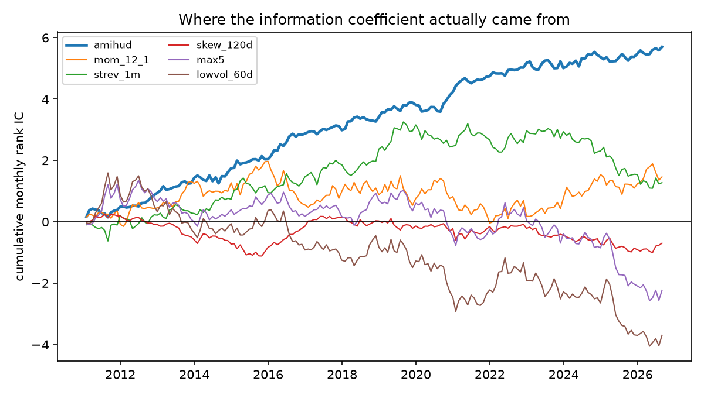
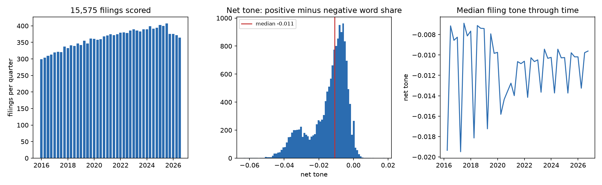

# equity-xs-alpha

Cross-sectional equity alpha research, end to end: signal construction → information
coefficient analysis → cost-aware long-short portfolios → ML signal combination under
purged walk-forward cross-validation.

The point of this repo is not "here is a Sharpe 3 strategy" (it isn't, and single-name
monthly factors on the S&P 500 shouldn't be). The point is the **research process**:
every number is out-of-sample where it claims to be, significance is measured with
autocorrelation-robust errors, and costs are charged before anything is called
performance.

```
pip install -e ".[dev]"
python scripts/run_research.py      # full run: download -> signals -> IC -> portfolios -> ML
pytest                              # 16 tests on synthetic data
```

Results land in `reports/results.md` and `reports/figures/`.

## Pipeline

```
universe.py    S&P 500 members (Wikipedia scrape), >=3y history filter
data.py        yfinance daily adjusted close + dollar volume, parquet cache
signals.py     8 signals, winsorized (median +/- 3*1.4826*MAD) and z-scored per date
edgar.py       rate-limited SEC EDGAR client (submissions index + filing documents)
text.py        Item 1A extraction, Loughran-McDonald scoring, tone-change panel
ic.py          Spearman rank IC, Newey-West t-stats, IC decay by horizon
portfolio.py   quintile long-short, equal weight per leg, linear cost model
cv.py          purged walk-forward folds with embargo
ml.py          LightGBM on cross-sectional rank labels, OOS scores only
```

## Signals

All signals are oriented so that **higher = higher expected forward return**, sampled
at month-end, and cleaned cross-sectionally. With daily returns $r_{i,t}$ and prices
$P_{i,t}$:

**Momentum (12-1)** — Jegadeesh & Titman (1993). Formation over months $t-12 \dots t-1$,
skipping the most recent month to avoid contamination by short-term reversal:

$$\text{MOM}_{i,t} = \prod_{s=t-252}^{t-21}(1+r_{i,s}) - 1$$

**Short-term reversal** — Jegadeesh (1990). Last month's losers outperform:

$$\text{STREV}_{i,t} = -\left(P_{i,t}/P_{i,t-21} - 1\right)$$

**Low volatility** — Ang, Hodrick, Xing & Zhang (2006). Negative of 60-day realized
daily-return standard deviation.

**MAX effect** — Bali, Cakici & Whitelaw (2011). Lottery-like names underperform; the
signal is the negative of the mean of the 5 largest daily returns over the last 21 days.

**Amihud illiquidity** — Amihud (2002). Illiquidity premium, log-compressed because the
raw measure spans orders of magnitude even inside the S&P 500:

$$\text{ILLIQ}_{i,t} = \log\left(\frac{1}{63}\sum_{s=t-62}^{t}\frac{|r_{i,s}|}{\text{DollarVol}_{i,s}}\right)$$

**Skewness** — negative of 120-day return skewness (investors overpay for positive skew).

**Filing tone change** — Loughran & McDonald (2011). Not the level of tone but the
change against the company's own previous filing of the same form, on 15,575 SEC
filings pulled straight from EDGAR:

$$\Delta\text{TONE}_{i,t} = \frac{n^{pos}_{i,t}-n^{neg}_{i,t}}{N_{i,t}} - \frac{n^{pos}_{i,t-1}-n^{neg}_{i,t-1}}{N_{i,t-1}}$$

The level is a company fixed effect — a bank writes more darkly than a software firm
and always will. Word counts come from the Loughran-McDonald finance dictionary, not a
general-purpose one, because in a 10-K "liability", "tax" and "capital" are not
negative words.

Cleaning per cross-section: winsorize at median $\pm 3 \times 1.4826 \times \text{MAD}$
(the 1.4826 factor makes MAD consistent with $\sigma$ under normality), then z-score.

## Methodology

### Information coefficient

$$\text{IC}_t = \text{corr}_{\text{Spearman}}\left(\text{signal}_{i,t},\; r_{i,t \to t+1}\right)$$

Monthly ICs are autocorrelated (signals overlap heavily month to month), so the
reported t-stat on the mean IC uses a **Newey-West (1987)** variance with a Bartlett
kernel at 6 lags:

$$\hat{V} = \hat\gamma_0 + 2\sum_{\ell=1}^{L}\left(1-\tfrac{\ell}{L+1}\right)\hat\gamma_\ell,
\qquad t = \frac{\overline{\text{IC}}}{\sqrt{\hat V / n}}$$

**IC decay** re-computes the mean IC against $k$-month-forward returns,
$k \in \{1,2,3,6,12\}$. Flat decay means the signal survives slow rebalancing; steep
decay means turnover (and therefore costs) is structural.

### Portfolios and costs

Top-minus-bottom quintile, equal weight inside each leg, dollar neutral, monthly
rebalance. Costs are linear: one-way turnover $\times$ 10 bps, charged every rebalance:

$$r^{\text{net}}_t = w_t^\top r_{t\to t+1} - \frac{\lVert w_t - w_{t-1}\rVert_1}{2}\cdot\text{10bps}$$

10 bps one-way is conservative-realistic for S&P 500 names at institutional size; the
cost parameter is a single argument if you want to stress it.

### Purged walk-forward CV

Random K-fold leaks here: the label at $t$ is the return over $(t, t+1]$, so adjacent
train/test samples share information (López de Prado, *Advances in Financial ML*, ch. 7).
The splitter in `cv.py` trains on an expanding window, **embargoes** one period between
train end and test start (removing the one-period label overlap), and predicts strictly
forward — 60 months minimum training, 12-month test blocks, rolled to the end of sample.

The ML model is deliberately boring: shallow LightGBM (depth 4, 15 leaves, heavy
subsampling) regressing the **cross-sectional percentile rank** of next-month return on
the 6 signals. Rank labels keep the target stationary across vol regimes. The model's
OOS score is then treated exactly like any raw signal — same z-scoring, same quintile
portfolio, same costs — so the comparison against the equal-weight signal combo is fair.

## Results

<!-- RESULTS:BEGIN -->
Regenerated 2026-09-03 with `uv run python scripts/run_research.py`. 495 names,
2010-01 to 2026-09, monthly rebalance, 10 bps one-way, plus 15,575 SEC filings from
2016-01. Full tables in `reports/results.md`.

**Standalone signal ICs** (full sample, Newey-West t-stats at 6 lags, BH q across the
eight tests):

| signal | mean IC | IC IR | NW t | hit rate | months | FDR q |
|---|---|---|---|---|---|---|
| amihud | 0.032 | 1.13 | **5.32** | 62% | 197 | **0.000** |
| tone_chg_naive | 0.007 | 0.45 | 1.37 | 57% | 125 | 0.46 |
| mom_12_1 | 0.008 | 0.15 | 0.69 | 54% | 188 | 0.60 |
| strev_1m | 0.006 | 0.13 | 0.64 | 48% | 199 | 0.60 |
| tone_chg | 0.003 | 0.15 | 0.46 | 55% | 124 | 0.65 |
| skew_120d | -0.004 | -0.17 | -0.70 | 46% | 195 | 0.60 |
| max5 | -0.015 | -0.26 | -1.16 | 48% | 199 | 0.49 |
| lowvol_60d | -0.023 | -0.33 | -1.50 | 47% | 198 | 0.46 |

Eight signals are tested against the same returns, so the largest t among them is not
distributed like a single t. Benjamini-Hochberg controls the expected share of false
positives among whatever gets called significant, and only the illiquidity premium
survives it. Bonferroni would too, and would also discard anything real; Harvey, Liu
and Zhu (2016) argue the cross-sectional literature needs this correction and mostly
does not apply it.

### The table above compares different decades

The text signal starts in 2016 because that is where the EDGAR pull starts; the price
signals reach back to 2010. Hold every one of them to the window they share:

| signal | mean IC | IC IR | NW t | hit rate | FDR q |
|---|---|---|---|---|---|
| amihud | 0.026 | 0.90 | **3.47** | 57% | **0.004** |
| tone_chg_naive | 0.007 | 0.44 | 1.34 | 57% | 0.36 |
| tone_chg | 0.003 | 0.15 | 0.46 | 55% | 0.99 |
| mom_12_1 | 0.002 | 0.03 | 0.12 | 53% | 0.99 |
| strev_1m | 0.001 | 0.02 | 0.06 | 48% | 0.99 |
| skew_120d | -0.000 | -0.00 | -0.01 | 51% | 0.99 |
| max5 | -0.023 | -0.40 | -1.45 | 46% | 0.36 |
| lowvol_60d | -0.030 | -0.44 | -1.64 | 45% | 0.36 |

Momentum's t-stat falls from 0.69 to 0.12. Nothing about the signal changed — 2010 to
2016 was carrying it, and the full-sample table quietly credited a 2016-onward text
signal with beating a momentum number earned in years it never saw.



**Long-short quintile portfolios, net of costs** (2015-02 onward, 139 months):

| portfolio | ann. ret | ann. vol | Sharpe | max DD | avg turnover |
|---|---|---|---|---|---|
| amihud | 8.5% | 8.2% | **1.03** | -13.5% | 0.14 |
| **ml_combo** | **7.3%** | **9.3%** | **0.79** | **-9.1%** | 1.07 |
| tone_chg_naive | 1.7% | 4.9% | 0.35 | -13.7% | 0.75 |
| mom_12_1 | 2.0% | 16.0% | 0.12 | -36.7% | 0.46 |
| tone_chg | -0.7% | 5.1% | -0.14 | -23.9% | 0.64 |
| strev_1m | -3.8% | 13.6% | -0.28 | -56.3% | 1.55 |
| skew_120d | -2.6% | 7.7% | -0.34 | -42.4% | 0.52 |
| equal_weight_combo | -7.8% | 13.7% | -0.57 | -69.1% | 1.00 |
| lowvol_60d | -15.2% | 19.5% | -0.78 | -88.2% | 0.45 |
| max5 | -14.8% | 17.4% | -0.85 | -86.9% | 1.13 |

The interesting result is `equal_weight_combo` against `ml_combo`. Naively averaging
z-scored signals — several of which have negative ICs — loses 7.8% a year, while the
purged walk-forward LightGBM learns out-of-sample which signals carry information and
lands within a quarter-point of the best standalone signal at two thirds of its
drawdown. The model is not manufacturing alpha; it is doing signal selection honestly.

Note the turnover column next to it. `amihud` earns its Sharpe on 0.14 turnover;
`ml_combo` needs 1.07 to earn less. At 10 bps that gap is affordable and at 50 bps it
is not, which is more useful to know about the ML model than its Sharpe.
<!-- RESULTS:END -->

## What the text signal is actually made of



15,575 filings, 445 tickers, 2016-01 to 2026-09, pulled from EDGAR at the rate limit
the SEC publishes and scored against the Loughran-McDonald dictionary. 93% of them are
scored on Item 1A, Risk Factors; the rest fall back to the whole document and say so in
a `scope` column. Median net tone is -0.011 — corporate disclosure is negative on net,
always, which is why the level is useless and the change is the signal.

The right-hand panel is where the project earns its keep. Median tone drops sharply
once a year and recovers, and the level shifts down in 2020 and never fully returns.
The annual sawtooth is not the news cycle.

### The signal was the filing calendar

| in this panel | median net tone | median words |
|---|--:|--:|
| 10-K | -0.0164 | 22,663 |
| 10-Q | -0.0097 | 14,544 |

An annual report reads darker than a quarterly for reasons of genre, not of business:
it is 1.6x longer and it is where the lawyers put the risk factors. Difference tone
across that boundary and every transition inherits it:

| transition | mean tone change | n |
|---|--:|--:|
| 10-Q → 10-K | **-0.0081** | 3,640 |
| 10-K → 10-Q | **+0.0086** | 3,882 |
| 10-Q → 10-Q | -0.0001 | 7,604 |

The genuine within-form move has a standard deviation of 0.0044. The mechanical
form-switch is nearly twice that, and it arrives on a fixed schedule.

It does not wash out cross-sectionally either, which is the part that makes it
dangerous rather than merely wrong. Only 71% of 10-Ks are filed in February; the other
29% are spread across the calendar. So in most months a minority of names have just
filed an annual report and carry a large negative change while the majority sit on a
quarterly, and the cross-sectional sort becomes a bet on fiscal-year-end — which is a
bet on industry with extra steps.

Difference within form instead — a 10-K against the previous 10-K — and the signal
mostly goes away:

| | mean IC | IC IR | NW t | hit rate | standalone Sharpe |
|---|--:|--:|--:|--:|--:|
| across forms (`tone_chg_naive`) | 0.007 | 0.44 | 1.34 | 57% | **+0.35** |
| within form (`tone_chg`) | 0.003 | 0.15 | 0.46 | 55% | **-0.14** |

Both are kept in the repo. The naive one is not there as a straw man; it is there
because it is what you get if you write the obvious `groupby("ticker").diff()`, it
looks like the second-best signal in the book, and nothing in its IC, hit rate or
equity curve tells you it is a calendar artefact.

### Does the text help the combination?

The honest answer needs the ablation run on an identical price panel and an identical
evaluation window, and getting there took two fixes.

**The price cache never hit.** The staleness test was `cached.index.min() > start`,
and since 2010-01-01 is a holiday the cached panel always began on the 4th and always
looked stale. Every run re-downloaded from Yahoo and the ML combo's Sharpe moved by
0.09 between runs on nothing but the latest adjustments — larger than the effect the
ablation was trying to measure.

**Listwise deletion made the training set a function of the sparsest signal.** The
model dropped any row with a missing feature. Adding the tone feature, which does not
exist before 2016 and is missing for a name between filings, cut the training set from
87,379 rows to 44,136. LightGBM picks a default direction for missing values at each
split, so a NaN costs that row nothing; dropping it costs everything. Before the fix
the ablation said Sharpe 0.71 → 0.44 and looked like strong evidence that text hurts.
It was evidence that `dropna` hurts.

With both fixed, same 139 months, same frozen prices:

| ML combo, 2015-02 onward | ann. ret | ann. vol | Sharpe | max DD |
|---|--:|--:|--:|--:|
| price and volume only | 8.4% | 8.8% | **0.95** | -9.5% |
| + both tone signals | 7.3% | 9.3% | 0.79 | -9.1% |

Adding text costs 0.17 of Sharpe. Every non-ML row is identical across the two runs,
which is how you know the comparison is clean.

```bash
uv run python scripts/build_text_panel.py --since 2016-01-01   # ~5 hours at the SEC rate limit
uv run python scripts/run_research.py
uv run python scripts/run_research.py --no-text --eval-start 2015-02-01   # the ablation
```


## Limitations (read this before quoting numbers)

- **Survivorship bias.** The universe is *today's* S&P 500 members extended backward.
  Names that were removed (bankruptcies, acquisitions, deletions) never enter the
  panel. This flatters long legs and dampens short legs — real point-in-time
  constituents (CRSP/Compustat via WRDS) are the correct fix and the code is structured
  so only `universe.py` needs to change.
- **No delisting returns**, same direction of bias as above.
- **Adjusted-close total returns** from Yahoo fold dividends into price; good enough
  for rank signals, not for precise level accounting.
- **Costs are linear.** No market impact, no borrow fees on the short leg.
- Monthly rebalance only; the IC-decay table hints at what faster rebalancing would
  buy, but intraday/weekly execution is out of scope here.
- **The EDGAR panel is a bag of words.** Loughran-McDonald counts word categories and
  knows nothing about negation, hedging or context: "we do not expect material losses"
  and "we expect material losses" score almost identically. A transformer embedding
  would read them differently and is the obvious next step.
- **Section extraction is regex over messy HTML.** 93% of filings resolve to Item 1A;
  868 fall back to the whole document and 155 to MD&A, and the `scope` column carries
  which. The MD&A patterns are the 10-K item numbers, so they rarely fire on a 10-Q,
  where the same section is Part I Item 2.
- **The text sample is one regime.** 2016 to 2026 contains one crisis. Ten years is
  not enough to distinguish a weak signal from no signal, which is most of why the
  tone t-stat lands where it does.

## References

Amihud (2002) · Ang, Hodrick, Xing, Zhang (2006) · Bali, Cakici, Whitelaw (2011) ·
Jegadeesh (1990) · Jegadeesh & Titman (1993) · Newey & West (1987) ·
López de Prado (2018), *Advances in Financial Machine Learning*

- Loughran, T. & McDonald, B. (2011), *When Is a Liability Not a Liability? Textual
  Analysis, Dictionaries, and 10-Ks*, Journal of Finance 66(1) — the finance
  dictionary, and the case that a general-purpose one mislabels half a 10-K.
- Campbell, J., Chen, H., Dhaliwal, D., Lu, H. & Steele, L. (2014), *The Information
  Content of Mandatory Risk Factor Disclosures*, Review of Accounting Studies 19(1).
- Benjamini, Y. & Hochberg, Y. (1995), *Controlling the False Discovery Rate*, JRSS-B.
- Harvey, C., Liu, Y. & Zhu, H. (2016), *... and the Cross-Section of Expected
  Returns*, Review of Financial Studies 29(1) — why the t-stat hurdle is not 2.0.

## License

MIT
